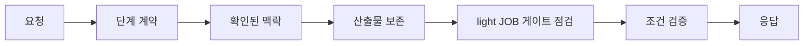

# integration-check · 통합 흐름 점검

## 전체 흐름 속 위치
강의 00~04의 연결을 합성 입력 하나로 확인합니다. 지휘 에이전트가 보낸 요청을 작업 에이전트가 단계 계약과 확인된 맥락 안에서 처리하고, light JOB 게이트가 읽는 필수 파일과 승인 근거를 대조한 뒤 같은 `request_id`로 응답합니다.



## 시작
저장소 루트에서 실행합니다.

```sh
make example NAME=integration-check
```

전체 예제 검사는 `make test`입니다. Python 표준 라이브러리만 사용합니다.

## 기대 결과
정상 fixture는 요청 식별자를 유지하고 `done` 응답 및 합성 산출물 경로를 냅니다. 출처 미확인, `verification.md` 누락, 승인 근거(`evidence`) 누락은 완료로 오인하지 않고 `partial`로 돌려줍니다. 이미 만들어진 산출물은 검증이 실패해도 남습니다.

## light JOB 게이트 대응
| 단계 | 게이트가 읽는 파일 |
|---|---|
| request | `request.md` |
| execution | `approval.md`(`approved_by`·`evidence`), `execution.md` |
| verification | `verification.md` |
| done | `result.md` |

## 구성
- `AGENTS.md`: 에이전트 작업 경계
- `PROMPT.md`: 에이전트 과제 지시
- `fixtures/`: 합성 요청·단계 계약·맥락·JOB 파일 목록 및 오류 사례
- `src/`: 통합 점검기
- `tests/`: 완료·비완료·산출물 보존 확인

외부 서비스, 네트워크, GPU, 자격 증명은 사용하지 않습니다.
